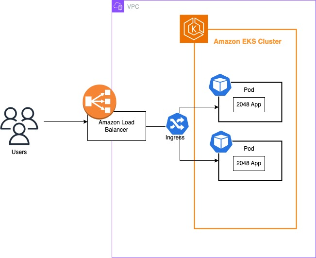
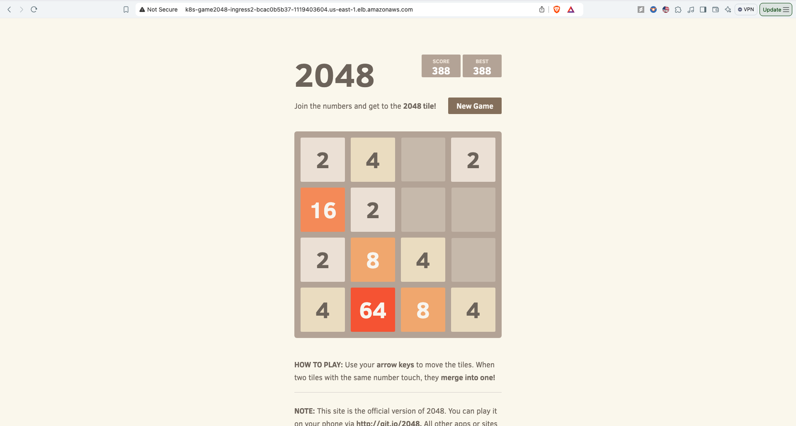

# Amazon EKS Cluster Setup Guide for 2048 Game:
This guide will walk you through setting up an EKS (Elastic Kubernetes Service) cluster with eksctl, deploying a sample application, and configuring an ALB (Application Load Balancer) for ingress.

## Architecture:


## Prerequisites
1. Install eksctl - https://eksctl.io/installation/
2. Configure AWS CLI - Ensure your AWS credentials and configuration are set up.
3. Install kubectl - https://kubernetes.io/docs/tasks/tools/

## Step 1: Create the EKS Cluster
We will use `eksctl` to create an EKS cluster in Fargate. Choose Fargate for serverless container orchestration unless your workload has specific requirements for EC2 instances.

```bash
eksctl create cluster --name demo-cluster --region us-east-1 --fargate
```

**Notes:**
- The command automatically creates a Private VPC.
- Cluster creation may take up to 15 minutes.
- The AWS-managed cluster includes features like pods, services, ingress, and a Kubernetes dashboard. Manual setups would require additional configuration.


## Step 2: Configurations and Deployments
Update kubeconfig to Access the Cluster
```bash
aws eks update-kubeconfig --name demo-cluster --region us-east-1
```

### Deploy the Sample Application with Helm
Set up a Fargate profile to deploy 2048 application in a separate name space

```bash
eksctl create fargateprofile \
    --cluster demo-cluster \
    --region us-east-1 \
    --name alb-sample-app \
    --namespace game-2048
```
Apply the application manifest:

```bash
kubectl apply -f 2048_full.yaml
````

Monitor the Deployment:
```bash
kubectl get pods -n game-2048 -w
```

## Step 3: Configure IAM for ALB Controller
Associate IAM OIDC provider for the cluster:

```bash
eksctl utils associate-iam-oidc-provider --cluster demo-cluster --region us-east-1 --approve
```

Create an IAM policy for the ALB Controller:

```bash
aws iam create-policy \
    --policy-name AWSLoadBalancerControllerIAMPolicy \
    --policy-document file://iam_policy.json
```

Create the IAM Service Account for the ALB Controller (replace Account Id with your account ID):

```bash
eksctl create iamserviceaccount \
  --cluster=demo-cluster \
  --namespace=kube-system \
  --name=aws-load-balancer-controller \
  --role-name AmazonEKSLoadBalancerControllerRole \
  --attach-policy-arn=arn:aws:iam::<Account ID>:policy/AWSLoadBalancerControllerIAMPolicy \
  --region us-east-1 \
  --approve
```

## Step 4: Deploy the ALB Ingress Controller
Add the EKS Helm repository:

```bash
helm repo add eks https://aws.github.io/eks-charts
```

Update the repo
```bash
helm repo update
```

Install the ALB Controller in the kube-system namespace:

```bash
helm install aws-load-balancer-controller eks/aws-load-balancer-controller -n kube-system \
  --set clusterName=demo-cluster \
  --set serviceAccount.create=false \
  --set serviceAccount.name=aws-load-balancer-controller \
  --set region=us-east-1 \
  --set vpcId=<vpc-Id>
```

**Notes:**
- This configuration deploys the ALB across two availability zones.
- Ensure you replace vpc-Id with your actual VPC ID. 

Get the ALB DNS Address and use the browser to access the app:
```bash
kubectl get ingress -n game-2048
```


## App:


## Step 5: Cleanup - Delete the Cluster
To delete the EKS cluster and all associated resources:

```bash
eksctl delete cluster --name demo-cluster --region us-east-1
```

## Learnings:
By following this guide, you’ve successfully set up a scalable and managed Kubernetes environment on AWS using EKS, eksctl, and Helm. Leveraging AWS Fargate for serverless compute and the ALB Ingress Controller for efficient load balancing, this setup provides a robust foundation for deploying and managing containerized applications. AWS EKS handles the complexity of underlying infrastructure, enabling you to focus on application development and deployment without manual configuration.

With Helm, application management becomes straightforward, allowing you to package, deploy, and manage Kubernetes applications with ease. This setup can be extended and customized further to suit specific application needs, whether by adding advanced IAM roles, integrating more AWS services, or scaling up with EC2 instances for greater control.

The following concepts are covered with this deployment:
- EKS
- IAM Policy
- IAM Role
- Fargate
- Ingress
- Ingress Controller -> ALB
- Helm

Happy deploying!
